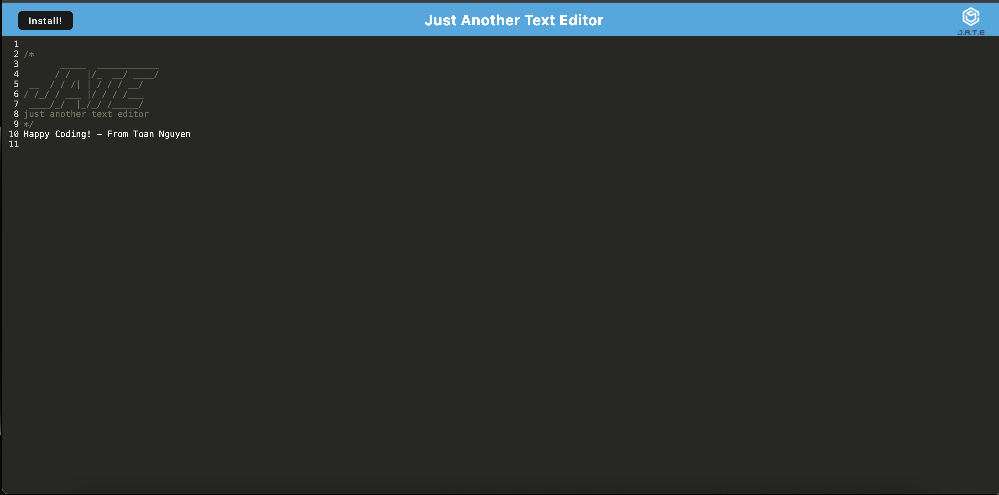

# Just Another Text Editor (PWA)

## Description

This is a text editor as a Progressive Web Application (PWA) using webpack, IndexedDB, and Workbox, allows users to type text into the browser. 

The indexedDB make data saved when the user inputs content and closes the application, then retrieve the data whene the user reopens the application. 

The webpack will bundle the application's static assets and use plugins and loaders to optimize the application. 

The service worker caches the application's resources and allows the application to function offline.

The text editor can even be installed onto the user's device.

## Screenshots

## Link